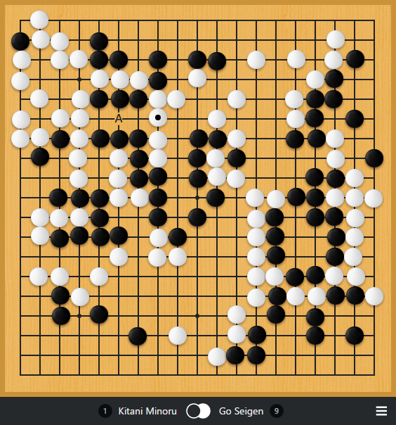

# Photorealistic Theme for Sabaki

A theme with photorealistic stones for [Sabaki](http://sabaki.yichuanshen.de/).

## Installation

For [Sabaki](http://sabaki.yichuanshen.de/) v0.31.0 or later you can [download](https://github.com/SabakiHQ/theme-photorealistic/releases) the theme file and install it directly inside Sabaki.

For older version, download the archive and extract everything under:

* `%APPDATA%\Sabaki` on Windows
* `$XDG_CONFIG_HOME/Sabaki` or `~/.config/Sabaki` on Linux
* `~/Library/Application Support/Sabaki` on macOS

## Build

To create a Sabaki theme package, install dependencies using npm, then run the build script:

~~~
npm install
npm run build
~~~

This will create `build/photorealistic.sabakitheme.asar`.

## License

Everything is released under [public domain](http://creativecommons.org/publicdomain/zero/1.0/).
